<p align="center">
  
  
  
  
  
  
</p>

<h1 align="center">🔐 Face Verification System</h1>
<h3 align="center">Real-Time One-Shot Face Verification using Siamese Neural Networks</h3>

<p align="center">
  A deep learning–powered face verification system that uses a <strong>Siamese Neural Network</strong> with a custom <strong>L1 Distance Layer</strong> to determine whether two face images belong to the same person. The model is trained on anchor/positive/negative triplets and deployed via a real-time <strong>Kivy desktop application</strong> with live webcam feed.
</p>

---

## 📑 Table of Contents

- [✨ Features](#-features)
- [🏗️ System Architecture](#️-system-architecture)
- [🧠 How Siamese Networks Work](#-how-siamese-networks-work)
- [📂 Project Structure](#-project-structure)
- [⚙️ Installation & Setup](#️-installation--setup)
- [🗂️ Data Pipeline](#️-data-pipeline)
- [🧬 Model Architecture](#-model-architecture)
- [🏋️ Training Pipeline](#️-training-pipeline)
- [📊 Evaluation & Metrics](#-evaluation--metrics)
- [🖥️ Real-Time Application](#️-real-time-application)
- [🔄 Verification Algorithm](#-verification-algorithm)
- [🛠️ Technology Stack](#️-technology-stack)
- [🚀 Usage Guide](#-usage-guide)
- [📈 Performance](#-performance)
- [🤝 Contributing](#-contributing)
- [📜 License](#-license)

---

## ✨ Features

| Feature | Description |
|---|---|
| 🧠 **Siamese Neural Network** | Twin-network architecture for one-shot face verification |
| 📐 **Custom L1 Distance Layer** | Computes element-wise absolute difference between face embeddings |
| 📷 **Real-Time Webcam** | Live camera feed at 33 FPS via OpenCV |
| 🖥️ **Kivy Desktop App** | Cross-platform GUI with one-click verification |
| ⚡ **Batch Inference** | Efficient batch prediction against multiple verification images |
| 🔒 **Threshold-Based Decisions** | Configurable detection & verification thresholds |
| 💾 **Checkpoint System** | TensorFlow checkpoint saving every 10 epochs |
| 🖼️ **Google Colab Training** | Full training pipeline compatible with Google Colab + GPU |

---

## 🏗️ System Architecture

```mermaid
graph TB
    subgraph "📷 Input Layer"
        A[Webcam Feed<br/>OpenCV VideoCapture] -->|Frame Capture<br/>250x250px| B[Image Preprocessor<br/>Resize to 100x100]
    end

    subgraph "🧠 Deep Learning Engine"
        B --> C[Siamese Neural Network]
        C --> D[Embedding Network<br/>CNN → 4096-D Vector]
        E[Verification Images<br/>Stored References] --> F[Embedding Network<br/>Shared Weights]
        D --> G[L1 Distance Layer<br/>|Anchor − Validation|]
        F --> G
        G --> H[Dense Classifier<br/>Sigmoid → 0 or 1]
    end

    subgraph "📊 Decision Engine"
        H --> I{Detection<br/>Threshold > 0.5?}
        I -->|Yes| J[Positive Detection]
        I -->|No| K[Negative Detection]
        J --> L{Verification<br/>Ratio > 0.5?}
        K --> L
        L -->|Yes| M[✅ VERIFIED]
        L -->|No| N[❌ UNVERIFIED]
    end

    subgraph "🖥️ Kivy Application"
        M --> O[Update UI Label<br/>'Verified']
        N --> O
        O --> P[Display Result to User]
    end

    style A fill:#4FC3F7,stroke:#0288D1,color:#000
    style C fill:#FFB74D,stroke:#F57C00,color:#000
    style G fill:#CE93D8,stroke:#8E24AA,color:#000
    style M fill:#81C784,stroke:#388E3C,color:#000
    style N fill:#E57373,stroke:#D32F2F,color:#000
```

---

## 🧠 How Siamese Networks Work

A **Siamese Network** is a twin-network architecture where both branches share identical weights. It learns a **similarity function** rather than classifying faces directly — making it ideal for **one-shot learning** tasks like face verification.

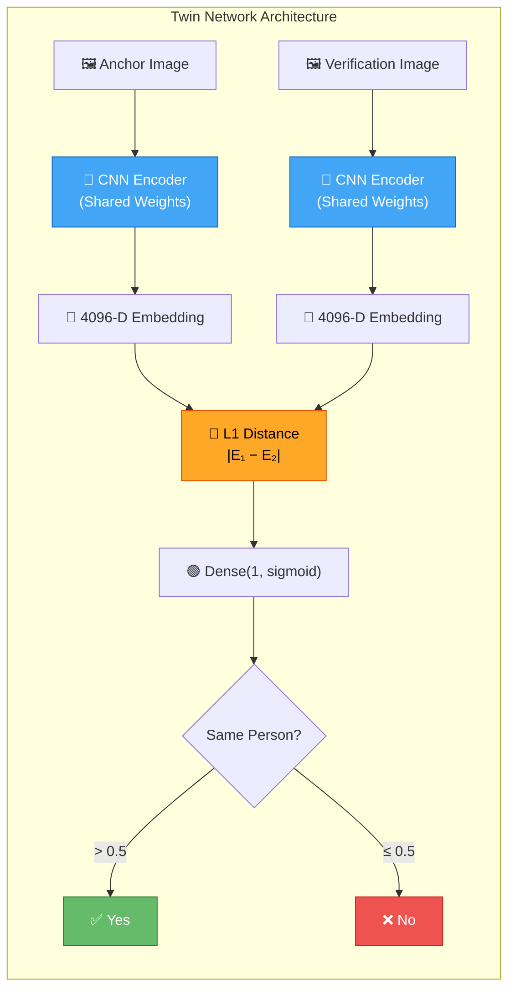

### Key Concepts

| Concept | Explanation |
|---|---|
| **Anchor** | The reference face image of the known person |
| **Positive** | Another image of the **same** person |
| **Negative** | An image of a **different** person |
| **Embedding** | A 4096-dimensional feature vector representing a face |
| **L1 Distance** | Element-wise absolute difference: `|embedding₁ - embedding₂|` |
| **One-Shot Learning** | Verify identity from a single (or few) reference image(s) |

---

## 📂 Project Structure

```
Face-recognoition_system/
│
├── 📄 faceid.py                  # Kivy desktop application (real-time verification)
├── 📄 layers.py                  # Custom L1 Distance layer for model loading
├── 📄 siamese_network_setup.py   # Full training pipeline (Colab-based)
├── 📄 requirements.txt           # Python dependencies
├── 📄 TODO.md                    # Development checklist
├── 📄 .gitignore                 # Git ignore rules
├── 📄 pyrightconfig.json         # Python type-checking config
│
├── 🧠 siamesemodelv2.h5          # Trained Siamese model weights (~155MB)
│
├── 📁 data/                      # Training dataset
│   ├── 📁 anchor/                # Anchor face images (your face)
│   ├── 📁 positive/              # Positive samples (your face, different shots)
│   └── 📁 negative/              # Negative samples (other people's faces)
│
├── 📁 application_data/          # Runtime application data
│   ├── 📁 input_image/           # Current webcam capture for verification
│   └── 📁 verification_images/   # Reference images to verify against
│
├── 📁 training_checkpoints/      # TensorFlow model checkpoints
├── 📁 .venv/                     # Python virtual environment
└── 📁 .conda/                    # Conda environment
```

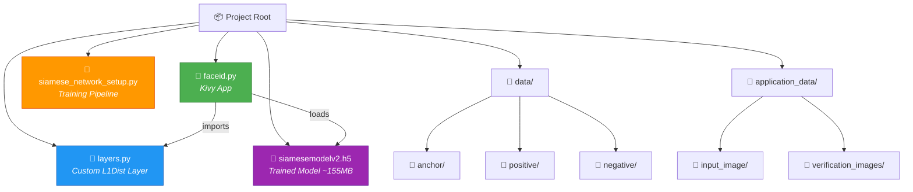

---

## ⚙️ Installation & Setup

### Prerequisites

- Python 3.10+
- NVIDIA GPU with CUDA support (recommended for training)
- Webcam (for real-time verification)

### Step-by-Step

```bash
# 1. Clone the repository
git clone https://github.com/Paragiscool/Face_verification_ml_project.git
cd Face_verification_ml_project

# 2. Create a virtual environment
python -m venv .venv

# 3. Activate the environment
# Windows:
.venv\Scripts\activate
# macOS/Linux:
source .venv/bin/activate

# 4. Install dependencies
pip install -r requirements.txt

# 5. Install Kivy (for the desktop app)
pip install kivy
```

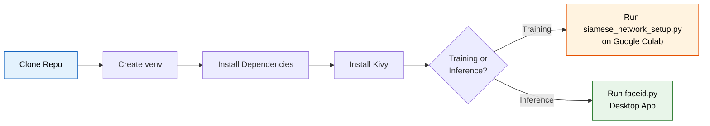

---

## 🗂️ Data Pipeline

### Data Collection Flow

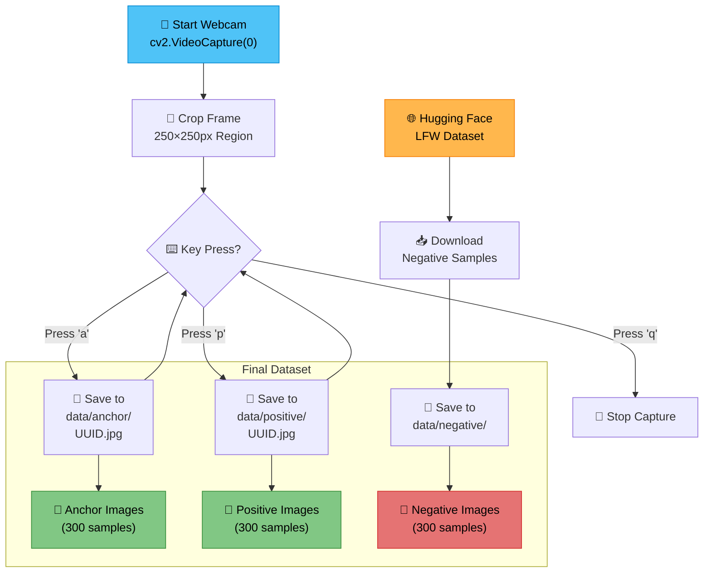

### Image Preprocessing Pipeline

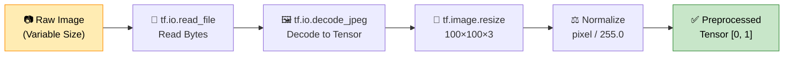

### Dataset Construction

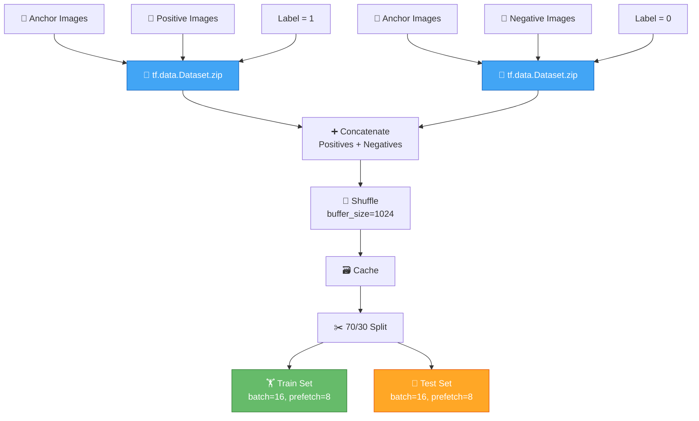

---

## 🧬 Model Architecture

### Embedding Network (CNN)

The embedding network transforms a `100×100×3` face image into a **4096-dimensional feature vector**.

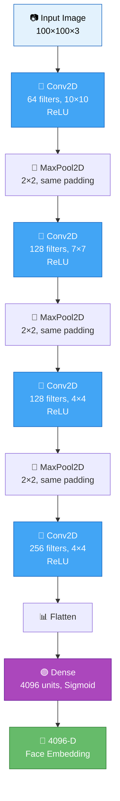

### Full Siamese Network Architecture

```
Layer (type)                    Output Shape         Param #     Connected to
================================================================================================
input_img (InputLayer)          [(None, 100, 100, 3)]  0         
validation_img (InputLayer)     [(None, 100, 100, 3)]  0         
embedding (Functional)          (None, 4096)         24,843,008  input_img, validation_img
L1_distance (L1Dist)            (None, 4096)         0           embedding[0], embedding[1]
dense_classifier (Dense)        (None, 1)            4,097       L1_distance
================================================================================================
Total params: 24,847,105
Trainable params: 24,847,105
Non-trainable params: 0
```

### Layer-by-Layer Parameter Breakdown

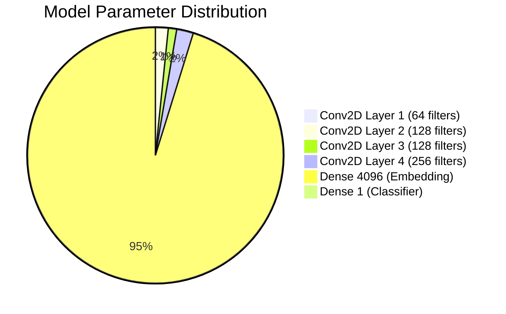

---

## 🏋️ Training Pipeline

### Training Flow

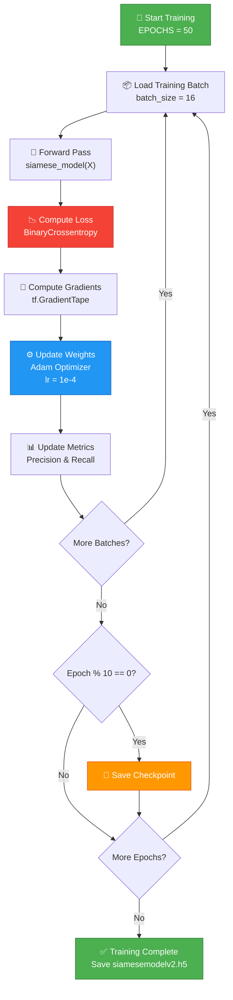

### Training Configuration

| Parameter | Value |
|---|---|
| **Optimizer** | Adam |
| **Learning Rate** | `1e-4` |
| **Loss Function** | Binary Cross-Entropy |
| **Epochs** | 50 |
| **Batch Size** | 16 |
| **Prefetch Buffer** | 8 |
| **Shuffle Buffer** | 1024 |
| **Train/Test Split** | 70% / 30% |
| **Checkpoint Interval** | Every 10 epochs |

### Custom Training Step (`@tf.function`)

```python
@tf.function
def train_step(batch):
    with tf.GradientTape() as tape:
        X = batch[:2]           # (anchor, positive/negative)
        y = batch[2]            # Label (1 or 0)
        yhat = siamese_model(X, training=True)
        loss = binary_cross_loss(y, yhat)

    grad = tape.gradient(loss, siamese_model.trainable_variables)
    opt.apply_gradients(zip(grad, siamese_model.trainable_variables))
    return loss
```

---

## 📊 Evaluation & Metrics

### Evaluation Flow

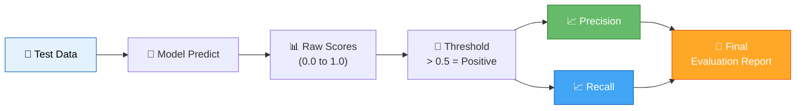

### Metrics Explained

| Metric | Formula | Meaning |
|---|---|---|
| **Precision** | `TP / (TP + FP)` | Of all faces flagged as "same person," how many actually are? |
| **Recall** | `TP / (TP + FN)` | Of all actual "same person" pairs, how many did we correctly identify? |
| **Detection Threshold** | `prediction > 0.5` | Minimum confidence to count a single comparison as positive |
| **Verification Threshold** | `detections / total > 0.5` | Minimum ratio of positive comparisons to verify identity |

---

## 🖥️ Real-Time Application

### Kivy App Architecture

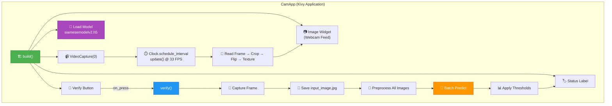

### Application Screenshot Layout

```
┌─────────────────────────────────┐
│                                 │
│        📷 Webcam Feed           │
│        (250×250 crop)           │
│                                 │
│                                 │
├─────────────────────────────────┤
│     [ 🔍 Verify Button ]       │
├─────────────────────────────────┤
│   Status: ✅ Verified           │
└─────────────────────────────────┘
```

---

## 🔄 Verification Algorithm

### Step-by-Step Verification Process

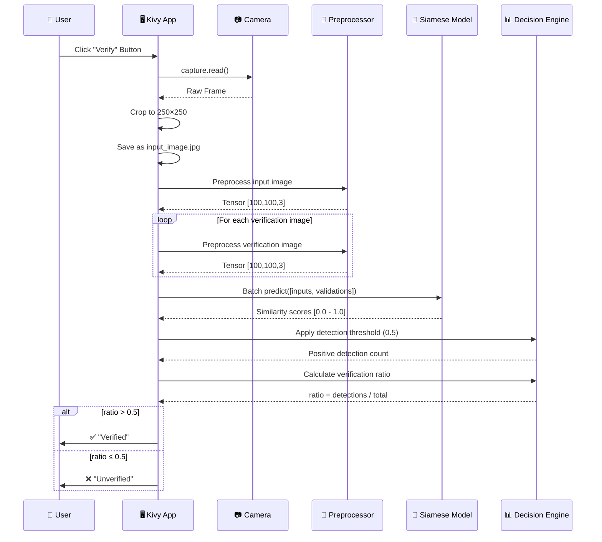

### Verification Logic (Pseudocode)

```
FUNCTION verify(input_frame, verification_images):
    scores = []
    
    FOR each ref_image IN verification_images:
        score = model.predict(input_frame, ref_image)
        scores.append(score)
    
    positive_count = COUNT(scores WHERE score > 0.5)    ← Detection Threshold
    ratio = positive_count / TOTAL(verification_images)
    
    IF ratio > 0.5:                                     ← Verification Threshold
        RETURN "✅ VERIFIED"
    ELSE:
        RETURN "❌ UNVERIFIED"
```

---

## 🛠️ Technology Stack

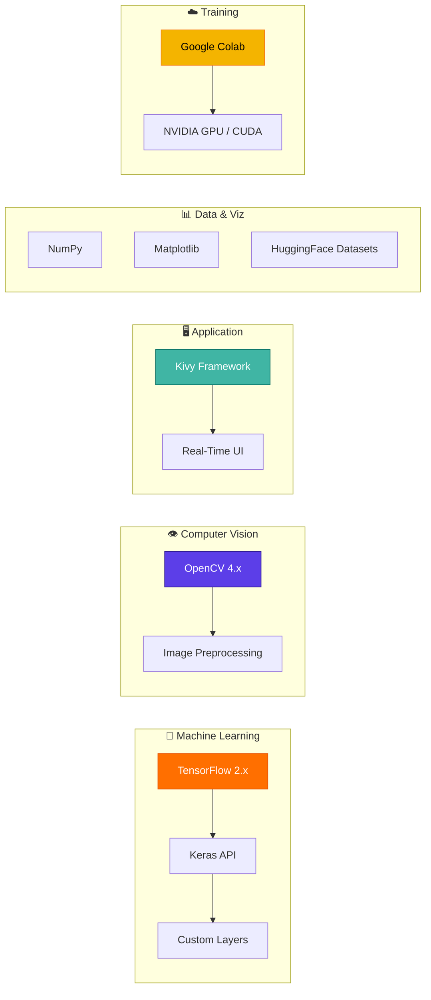

### Dependencies

| Package | Purpose |
|---|---|
| `tensorflow` | Deep learning framework — model building, training, inference |
| `opencv-python` | Webcam capture, image I/O, frame manipulation |
| `matplotlib` | Training visualization and image plotting |
| `datasets` | HuggingFace datasets library for negative samples (LFW) |
| `tqdm` | Progress bars during data processing |
| `kivy` | Cross-platform desktop GUI framework |
| `numpy` | Numerical operations on predictions and thresholds |

---

## 🚀 Usage Guide

### 1. Collect Training Data

```bash
# Run the data collection script (requires webcam)
python siamese_network_setup.py

# Press 'a' → Save anchor image
# Press 'p' → Save positive image  
# Press 'q' → Quit collection
```

### 2. Train the Model (Google Colab Recommended)


### 3. Set Up Verification Images

```bash
# Place 3-5 reference images of your face in:
application_data/verification_images/
```

### 4. Run the Application

```bash
python faceid.py
```

### 5. Verify Your Identity

1. Position your face in front of the webcam
2. Click the **"Verify"** button
3. See the result: ✅ **Verified** or ❌ **Unverified**

---

## 📈 Performance

### Model Summary

| Property | Value |
|---|---|
| **Total Parameters** | ~24.8 Million |
| **Trainable Parameters** | ~24.8 Million |
| **Model File Size** | ~155 MB |
| **Input Resolution** | 100×100×3 |
| **Embedding Dimension** | 4096 |
| **Output** | Single sigmoid (0–1) |
| **Inference Speed** | Real-time at 33 FPS |

### Training Progression

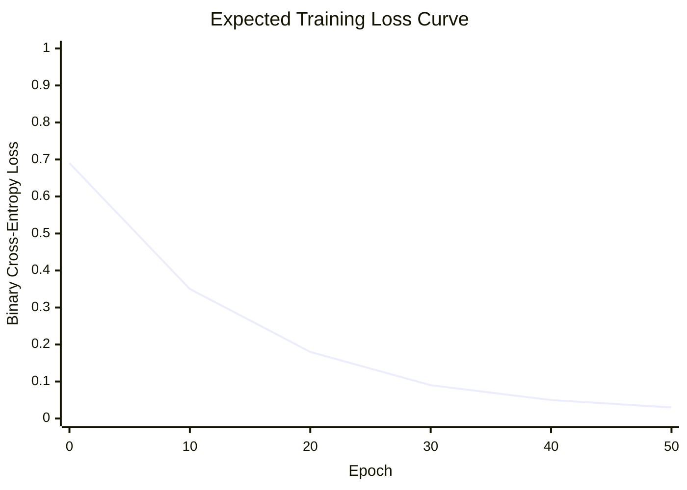

---

## 🤝 Contributing

Contributions are welcome! Here's how you can help:

1. **Fork** the repository
2. **Create** a feature branch (`git checkout -b feature/amazing-feature`)
3. **Commit** your changes (`git commit -m 'Add amazing feature'`)
4. **Push** to the branch (`git push origin feature/amazing-feature`)
5. **Open** a Pull Request

```mermaid
gitgraph
    commit id: "Initial Commit"
    commit id: "Add training pipeline"
    commit id: "Add Kivy app"
    branch feature/improvements
    commit id: "Optimize batch inference"
    commit id: "Add error handling"
    checkout main
    merge feature/improvements id: "Merge improvements"
    commit id: "Update README"
```

### Development Ideas

- [ ] Add face detection (MTCNN/Haar Cascades) before cropping
- [ ] Support multiple user profiles
- [ ] Add a web-based interface (Flask/FastAPI)
- [ ] Implement data augmentation for training
- [ ] Add confidence score display in UI
- [ ] Export to TFLite for mobile deployment

---

## 📜 License

This project is open source and available under the [MIT License](LICENSE).

---

<p align="center">
  <b>Built with ❤️ using TensorFlow, OpenCV, and Kivy</b><br/>
  <i>A Siamese Neural Network approach to real-time face verification</i>
</p>

<p align="center">
  <a href="https://github.com/Paragiscool/Face_verification_ml_project">
    
  </a>
</p>
